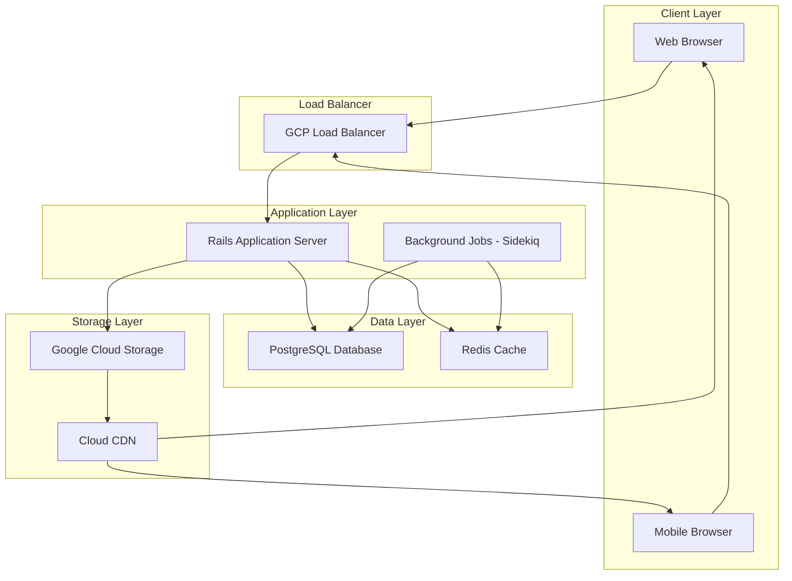

# 設計書

## 概要

ねんど制作コミュニティサイトは、Ruby on Rails をベースとしたWebアプリケーションとして構築します。Docker コンテナ化により開発・デプロイメントを標準化し、Google Cloud Platform (GCP) でホスティングします。レスポンシブデザインによりモバイル・デスクトップ両方に対応し、画像処理とファイルストレージにはGCPサービスを活用します。

## アーキテクチャ

### システムアーキテクチャ



### 技術スタック

- **バックエンドフレームワーク**: Ruby on Rails 7.x
- **データベース**: PostgreSQL 15
- **キャッシュ**: Redis 7
- **バックグラウンドジョブ**: Sidekiq
- **ファイルストレージ**: Google Cloud Storage
- **CDN**: Google Cloud CDN
- **コンテナ**: Docker & Docker Compose
- **ホスティング**: Google Cloud Run
- **フロントエンド**: Rails Views with Stimulus.js & Turbo
- **CSSフレームワーク**: Tailwind CSS
- **画像処理**: ImageMagick with Active Storage

## コンポーネントとインターフェース

### コアモデル

#### Userモデル
```ruby
class User < ApplicationRecord
  # Authentication
  has_secure_password
  
  # Profile information
  has_one_attached :profile_image
  
  # Relationships
  has_many :posts, dependent: :destroy
  has_many :comments, dependent: :destroy
  has_many :likes, dependent: :destroy
  has_many :follows, foreign_key: 'follower_id', dependent: :destroy
  has_many :followed_users, through: :follows, source: :followed
  has_many :reverse_follows, foreign_key: 'followed_id', class_name: 'Follow'
  has_many :followers, through: :reverse_follows, source: :follower
  
  # Validations
  validates :email, presence: true, uniqueness: true
  validates :username, presence: true, uniqueness: true
  validates :skill_level, inclusion: { in: %w[beginner intermediate advanced expert] }
end
```

#### Postモデル
```ruby
class Post < ApplicationRecord
  belongs_to :user
  has_many_attached :images
  has_many :comments, dependent: :destroy
  has_many :likes, dependent: :destroy
  has_many :post_tags, dependent: :destroy
  has_many :tags, through: :post_tags
  
  validates :title, presence: true, length: { maximum: 100 }
  validates :description, presence: true, length: { maximum: 2000 }
  validates :images, presence: true
  
  enum post_type: { regular: 0, tutorial: 1 }
  enum difficulty_level: { beginner: 0, intermediate: 1, advanced: 2, expert: 3 }
  
  scope :published, -> { where(published: true) }
  scope :recent, -> { order(created_at: :desc) }
  scope :popular, -> { joins(:likes).group('posts.id').order('COUNT(likes.id) DESC') }
end
```

### APIエンドポイント

#### 認証
- `POST /api/v1/auth/register` - ユーザー登録
- `POST /api/v1/auth/login` - ユーザーログイン
- `DELETE /api/v1/auth/logout` - ユーザーログアウト
- `GET /api/v1/auth/me` - 現在のユーザー情報

#### 投稿
- `GET /api/v1/posts` - ページネーションとフィルター付き投稿一覧
- `POST /api/v1/posts` - 新規投稿作成
- `GET /api/v1/posts/:id` - 特定の投稿取得
- `PUT /api/v1/posts/:id` - 投稿更新（所有者のみ）
- `DELETE /api/v1/posts/:id` - 投稿削除（所有者のみ）

#### インタラクション
- `POST /api/v1/posts/:id/like` - 投稿のいいね/いいね解除
- `POST /api/v1/posts/:id/comments` - コメント追加
- `DELETE /api/v1/comments/:id` - コメント削除

#### ソーシャル機能
- `POST /api/v1/users/:id/follow` - ユーザーフォロー/フォロー解除
- `GET /api/v1/users/:id/followers` - ユーザーのフォロワー取得
- `GET /api/v1/users/:id/following` - ユーザーのフォロー中取得
- `GET /api/v1/feed` - パーソナライズドフィード取得

## データモデル

### データベーススキーマ

```sql
-- Users table
CREATE TABLE users (
  id BIGSERIAL PRIMARY KEY,
  email VARCHAR(255) NOT NULL UNIQUE,
  username VARCHAR(50) NOT NULL UNIQUE,
  password_digest VARCHAR(255) NOT NULL,
  bio TEXT,
  skill_level VARCHAR(20) DEFAULT 'beginner',
  created_at TIMESTAMP NOT NULL,
  updated_at TIMESTAMP NOT NULL
);

-- Posts table
CREATE TABLE posts (
  id BIGSERIAL PRIMARY KEY,
  user_id BIGINT NOT NULL REFERENCES users(id),
  title VARCHAR(100) NOT NULL,
  description TEXT NOT NULL,
  post_type INTEGER DEFAULT 0,
  difficulty_level INTEGER,
  published BOOLEAN DEFAULT true,
  created_at TIMESTAMP NOT NULL,
  updated_at TIMESTAMP NOT NULL
);

-- Comments table
CREATE TABLE comments (
  id BIGSERIAL PRIMARY KEY,
  user_id BIGINT NOT NULL REFERENCES users(id),
  post_id BIGINT NOT NULL REFERENCES posts(id),
  content TEXT NOT NULL,
  created_at TIMESTAMP NOT NULL,
  updated_at TIMESTAMP NOT NULL
);

-- Likes table
CREATE TABLE likes (
  id BIGSERIAL PRIMARY KEY,
  user_id BIGINT NOT NULL REFERENCES users(id),
  post_id BIGINT NOT NULL REFERENCES posts(id),
  created_at TIMESTAMP NOT NULL,
  UNIQUE(user_id, post_id)
);

-- Follows table
CREATE TABLE follows (
  id BIGSERIAL PRIMARY KEY,
  follower_id BIGINT NOT NULL REFERENCES users(id),
  followed_id BIGINT NOT NULL REFERENCES users(id),
  created_at TIMESTAMP NOT NULL,
  UNIQUE(follower_id, followed_id)
);

-- Tags table
CREATE TABLE tags (
  id BIGSERIAL PRIMARY KEY,
  name VARCHAR(50) NOT NULL UNIQUE,
  created_at TIMESTAMP NOT NULL,
  updated_at TIMESTAMP NOT NULL
);

-- Post Tags junction table
CREATE TABLE post_tags (
  id BIGSERIAL PRIMARY KEY,
  post_id BIGINT NOT NULL REFERENCES posts(id),
  tag_id BIGINT NOT NULL REFERENCES tags(id),
  UNIQUE(post_id, tag_id)
);
```

### ファイルストレージ戦略

- **プロフィール画像**: GCSバケット `clay-community-profiles/` に保存
- **投稿画像**: GCSバケット `clay-community-posts/` に保存
- **画像バリアント**: サムネイルと最適化バージョンを自動生成
- **CDN**: パフォーマンス向上のため、すべての画像をGoogle Cloud CDN経由で配信

## エラーハンドリング

### アプリケーションレベルのエラーハンドリング

```ruby
class ApplicationController < ActionController::Base
  rescue_from ActiveRecord::RecordNotFound, with: :not_found
  rescue_from ActiveRecord::RecordInvalid, with: :unprocessable_entity
  rescue_from Pundit::NotAuthorizedError, with: :forbidden
  
  private
  
  def not_found
    render json: { error: 'Resource not found' }, status: :not_found
  end
  
  def unprocessable_entity(exception)
    render json: { 
      error: 'Validation failed', 
      details: exception.record.errors.full_messages 
    }, status: :unprocessable_entity
  end
  
  def forbidden
    render json: { error: 'Access denied' }, status: :forbidden
  end
end
```

### 画像アップロードエラーハンドリング

- ファイルサイズ検証（画像1枚あたり最大10MB）
- ファイルタイプ検証（JPEG、PNG、WebPのみ）
- ウイルススキャン統合
- アップロード失敗時のグレースフルデグラデーション
- 一時的な失敗に対するリトライメカニズム

### データベースエラーハンドリング

- コネクションプール設定
- 一時的な失敗に対する自動リトライ
- データベース利用不可時のグレースフルデグラデーション
- デバッグ用の包括的ログ記録

## テスト戦略

### テスト構造

```
spec/
├── models/           # Model unit tests
├── controllers/      # Controller tests
├── requests/         # API integration tests
├── features/         # End-to-end feature tests
├── services/         # Service object tests
├── jobs/            # Background job tests
└── support/         # Test helpers and factories
```

### テストツール

- **フレームワーク**: RSpec
- **ファクトリー**: FactoryBot
- **モック**: RSpec mocks
- **フィーチャーテスト**: Capybara with Selenium
- **APIテスト**: Request specs
- **カバレッジ**: SimpleCov

### テストカテゴリー

#### ユニットテスト
- モデルのバリデーションとアソシエーション
- サービスオブジェクトのビジネスロジック
- ヘルパーメソッド
- ユーティリティクラス

#### 統合テスト
- APIエンドポイント機能
- 認証と認可
- ファイルアップロードワークフロー
- バックグラウンドジョブ処理

#### フィーチャーテスト
- ユーザー登録とログインフロー
- 投稿作成と公開
- ソーシャルインタラクション機能
- 管理者モデレーションワークフロー

### パフォーマンステスト

- Apache Benchによる負荷テスト
- データベースクエリ最適化
- 画像処理パフォーマンス
- CDNキャッシュ効果

### セキュリティテスト

- 認証バイパス試行
- SQLインジェクション防止
- XSS保護検証
- ファイルアップロードセキュリティ
- レート制限効果

## デプロイメントアーキテクチャ

### Docker設定

```dockerfile
# Dockerfile
FROM ruby:3.2-alpine

RUN apk add --no-cache \
  build-base \
  postgresql-dev \
  imagemagick \
  imagemagick-dev

WORKDIR /app
COPY Gemfile* ./
RUN bundle install

COPY . .
EXPOSE 3000
CMD ["rails", "server", "-b", "0.0.0.0"]
```

### GCPサービス統合

- **Cloud Run**: オートスケーリング付きコンテナホスティング
- **Cloud SQL**: マネージドPostgreSQLデータベース
- **Cloud Storage**: ファイルと画像ストレージ
- **Cloud CDN**: グローバルコンテンツ配信
- **Cloud Monitoring**: アプリケーション監視とアラート

### GitHub ActionsによるCI/CDパイプライン

```yaml
# .github/workflows/deploy.yml
name: Deploy to GCP Cloud Run

on:
  push:
    branches: [main]
  pull_request:
    branches: [main]

env:
  PROJECT_ID: clay-community-site
  SERVICE_NAME: clay-community-app
  REGION: asia-northeast1

jobs:
  test:
    runs-on: ubuntu-latest
    services:
      postgres:
        image: postgres:15
        env:
          POSTGRES_PASSWORD: postgres
        options: >-
          --health-cmd pg_isready
          --health-interval 10s
          --health-timeout 5s
          --health-retries 5
      redis:
        image: redis:7
        options: >-
          --health-cmd "redis-cli ping"
          --health-interval 10s
          --health-timeout 5s
          --health-retries 5
    
    steps:
    - uses: actions/checkout@v4
    - uses: ruby/setup-ruby@v1
      with:
        bundler-cache: true
    - name: Run tests
      run: |
        bundle exec rails db:create db:migrate
        bundle exec rspec
        
  deploy:
    needs: test
    runs-on: ubuntu-latest
    if: github.ref == 'refs/heads/main'
    
    steps:
    - uses: actions/checkout@v4
    
    - id: 'auth'
      uses: 'google-github-actions/auth@v1'
      with:
        credentials_json: '${{ secrets.GCP_SA_KEY }}'
    
    - name: 'Set up Cloud SDK'
      uses: 'google-github-actions/setup-gcloud@v1'
    
    - name: 'Configure Docker'
      run: gcloud auth configure-docker
    
    - name: 'Build and Push Docker image'
      run: |
        docker build -t gcr.io/$PROJECT_ID/$SERVICE_NAME:$GITHUB_SHA .
        docker push gcr.io/$PROJECT_ID/$SERVICE_NAME:$GITHUB_SHA
    
    - name: 'Deploy to Cloud Run'
      run: |
        gcloud run deploy $SERVICE_NAME \
          --image gcr.io/$PROJECT_ID/$SERVICE_NAME:$GITHUB_SHA \
          --platform managed \
          --region $REGION \
          --allow-unauthenticated \
          --set-env-vars="RAILS_ENV=production" \
          --set-cloudsql-instances=$PROJECT_ID:$REGION:clay-community-db
```

### 環境管理

- **開発環境**: ローカルDocker Compose環境
- **ステージング環境**: `develop`ブランチからの自動デプロイ
- **本番環境**: テスト通過後の`main`ブランチからの自動デプロイ
- **フィーチャーブランチ**: テスト用の手動デプロイオプション